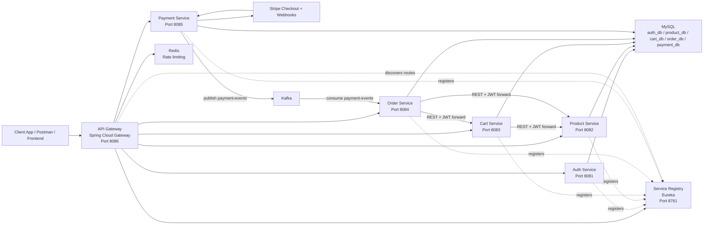

# E-Commerce Platform HLD

## Purpose
This document describes the high-level design of the `e-commerce` microservices platform found in this repository.

## Scope
The HLD covers:
- `api-gateway`
- `service-registry`
- `auth-service`
- `product-service`
- `cart-service`
- `order-service`
- `payment-service`
- Shared infrastructure from Docker and Kubernetes assets

## System Overview
The platform is a Spring Boot based microservices system for a simple e-commerce workflow:
1. Users authenticate through `auth-service`.
2. All client traffic enters through `api-gateway`.
3. Product browsing and admin product management happen in `product-service`.
4. Shopping cart operations happen in `cart-service`.
5. Order placement happens in `order-service`.
6. Checkout is initiated in `payment-service` through Stripe.
7. Payment completion or failure is propagated through Kafka and used by `order-service` to update order status.

## Consolidated HLD Diagram

## Main Building Blocks
### API Gateway
- Entry point for all external traffic.
- Performs JWT validation except for `/api/auth/**`.
- Applies Redis-backed request rate limiting.
- Routes by service name through Eureka load balancing.

### Service Registry
- Eureka server for service registration and discovery.
- Used by all runtime services and the gateway.

### Auth Service
- Handles registration, login, and service token generation.
- Issues JWTs containing `userId` and roles.
- Uses MySQL database `auth_db`.

### Product Service
- Handles product catalog CRUD.
- Uses role-based authorization:
  - `USER` and `ADMIN` can read.
  - `ADMIN` can create, update, delete.
- Uses MySQL database `product_db`.

### Cart Service
- Maintains user carts in MySQL `cart_db`.
- Calls `product-service` to validate product existence and stock before adding items.

### Order Service
- Builds orders from current cart contents.
- Calls `cart-service` to fetch and clear the cart.
- Calls `product-service` to resolve current prices.
- Stores orders in MySQL `order_db`.
- Updates order status asynchronously from Kafka payment events.

### Payment Service
- Creates Stripe checkout sessions.
- Receives Stripe webhooks.
- Publishes payment result events to Kafka.
- Uses MySQL `payment_db` in configuration, though current code is mainly gateway and event oriented.

## Key Runtime Flows
### Authentication Flow
1. Client calls `POST /api/auth/register` or `POST /api/auth/login`.
2. `auth-service` validates user data against MySQL.
3. `auth-service` returns JWT for authenticated users.
4. Client sends JWT in `Authorization: Bearer ...` for protected APIs.

### Cart Flow
1. Client calls `POST /api/cart/add`.
2. Gateway validates JWT.
3. `cart-service` extracts `userId` from the token.
4. `cart-service` calls `product-service` to validate product and stock.
5. Cart is updated in MySQL.

### Order Placement Flow
1. Client calls `POST /api/orders/place`.
2. `order-service` fetches the user's cart from `cart-service`.
3. `order-service` fetches product prices from `product-service`.
4. `order-service` saves the order with status `PENDING`.
5. `order-service` clears the cart.

### Payment Flow
1. Client calls `POST /api/payments/checkout/{orderId}`.
2. `payment-service` creates a Stripe checkout session and returns a checkout URL.
3. Stripe later calls `POST /api/payments/webhook`.
4. `payment-service` validates webhook signature.
5. `payment-service` publishes `PAID` or `FAILED` event to Kafka topic `payment-events`.
6. `order-service` consumes the event and updates order status.

## Deployment View
- Local orchestration is defined in [docker-compose.yml](C:/myworkspace/projects/e-commerce/docker-compose.yml) and [docker-compose-lite.yml](C:/myworkspace/projects/e-commerce/docker-compose-lite.yml).
- Kubernetes manifests exist under `k8s/`, currently including namespace and `api-gateway` deployment assets.
- Shared infrastructure:
  - MySQL
  - Redis
  - Kafka
  - Zookeeper

## Cross-Cutting Concerns
### Security
- JWT-based authentication.
- Authorization checks are enforced in service-level Spring Security and controller annotations.
- Gateway blocks unauthenticated requests for non-auth routes.

### Discovery and Routing
- Eureka is the discovery source.
- Service-to-service calls use logical names like `http://PRODUCT-SERVICE/...` and `http://CART-SERVICE/...`.

### Rate Limiting
- Implemented in `api-gateway` with Redis.
- Current limit is `5` replenish rate and `10` burst capacity per client IP.

### Event-Driven Integration
- Kafka topic `payment-events` decouples payment completion from order status updates.

## Observed Design Characteristics
### Strengths
- Clear microservice separation by business capability.
- Central gateway and service discovery pattern.
- Synchronous flows for request/response use cases and asynchronous Kafka for payment status propagation.

### Current Gaps
- `api-gateway` mutates request headers after JWT parsing, but downstream services still parse the original token themselves.
- `payment-service` includes placeholder client interfaces and some incomplete persistence wiring.
- Kubernetes manifests are partial compared with Docker Compose coverage.
- Error handling is mostly runtime-exception based in business flows.

## Result
The repository implements a runnable microservices architecture for a basic e-commerce domain with:
- Centralized ingress via API Gateway
- Service discovery via Eureka
- Per-service persistence in MySQL
- Gateway throttling with Redis
- Payment event propagation through Kafka
- External payment processing through Stripe
