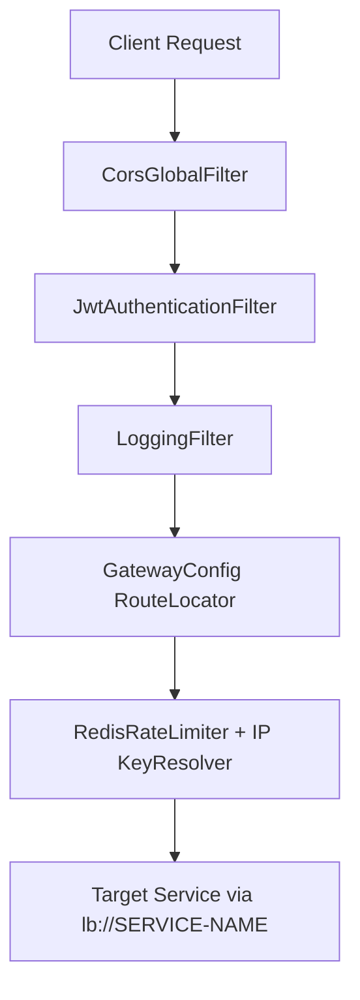
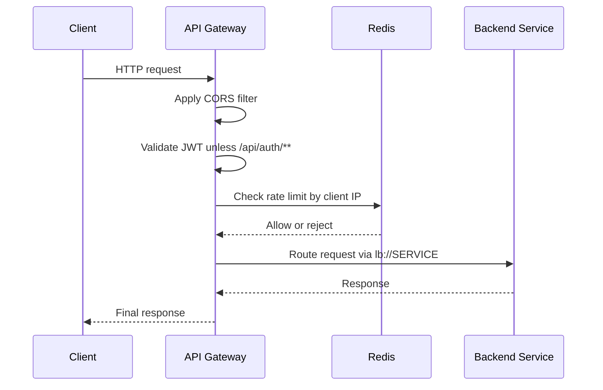

# API Gateway LLD

## Service Summary
- Service: `api-gateway`
- Port: `8086`
- Framework: Spring Cloud Gateway
- Responsibilities:
  - Route external requests to backend services
  - Validate JWT for protected routes
  - Apply Redis-backed rate limiting
  - Log request and response traffic

## Internal Structure

## Main Components
### `GatewayConfig`
- Declares `RedisRateLimiter(5, 10)`.
- Declares route mappings:
  - `/api/auth/**` -> `AUTH-SERVICE`
  - `/api/products/**` -> `PRODUCT-SERVICE`
  - `/api/cart/**` -> `CART-SERVICE`
  - `/api/orders/**` -> `ORDER-SERVICE`
  - `/api/payments/**` -> `PAYMENT-SERVICE`
- Uses client IP as the rate-limit key.

### `JwtAuthenticationFilter`
- Skips JWT validation for `/api/auth`.
- Requires `Authorization: Bearer <token>` for other routes.
- Parses JWT using shared secret from config.
- Rejects invalid or missing tokens with `401 Unauthorized`.

### `LoggingFilter`
- Logs inbound method and URI.
- Logs outbound response status.

### `CorsGlobalFilter`
- Handles CORS behavior before auth and routing.

### `GlobalErrorHandler`
- Central place for gateway-side exception handling.

## Request Processing Flow

## Dependencies
- Eureka for service lookup
- Redis for rate limiting
- Shared JWT secret for token validation

## Notable Design Notes
- Gateway security is coarse-grained and mainly ensures presence and validity of JWT.
- Business authorization still happens inside downstream services.
- Routing is explicitly configured in Java and partly in `application.yml`.

## Result
`api-gateway` is the platform ingress layer and enforces the first line of traffic governance: routing, JWT validation, rate limiting, and logging.
