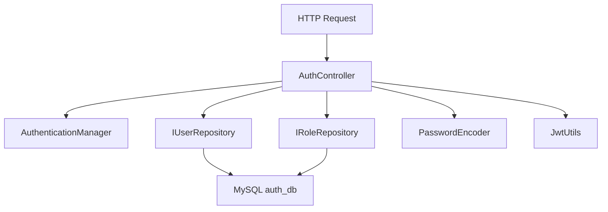
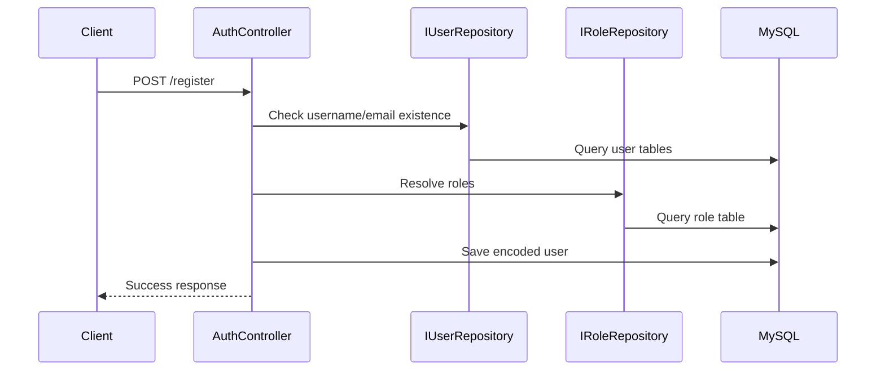
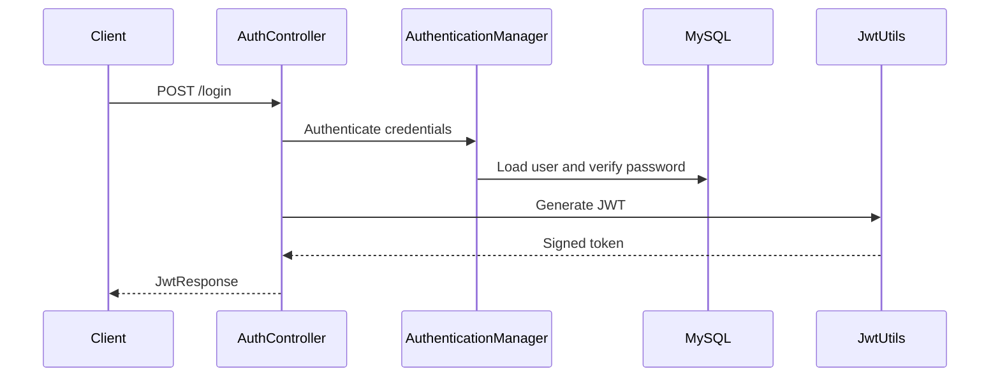

# Auth Service LLD

## Service Summary
- Service: `auth-service`
- Port: `8081`
- Database: MySQL `auth_db`
- Responsibilities:
  - User registration
  - User login
  - JWT generation
  - Service token generation for trusted internal clients

## Internal Structure

## Main Components
### `AuthController`
Endpoints:
- `POST /api/auth/register`
- `POST /api/auth/login`
- `POST /api/auth/token`

Responsibilities:
- Register new users after uniqueness checks
- Authenticate username and password
- Build JWT response with user id, username, email, and roles
- Issue service token for `payment-service` using static client credentials

### `JwtUtils`
- Generates JWT for end users with:
  - subject = username
  - claim `userId`
  - claim `roles`
- Validates JWT signature and expiration
- Generates internal service token with role `SERVICE`

### `UserDetailsServiceImpl` and `UserDetailsImpl`
- Bridge user records into Spring Security authentication flow.

### Repositories
- `IUserRepository`
- `IRoleRepository`

### Security Layer
- `WebSecurityConfig`
- `AuthTokenFilter`
- `AuthEntryPointJwt`

## Registration Flow

## Login Flow

## Data Model
- `User`
- `Role`
- User-to-role association

## Dependencies
- MySQL
- Eureka
- Spring Security

## Result
`auth-service` is the identity provider for the platform and the source of JWTs used across the rest of the services.
