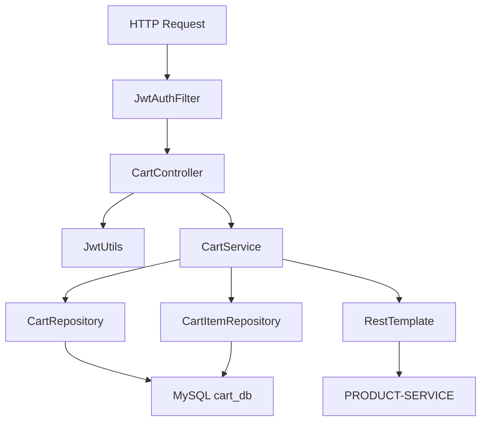
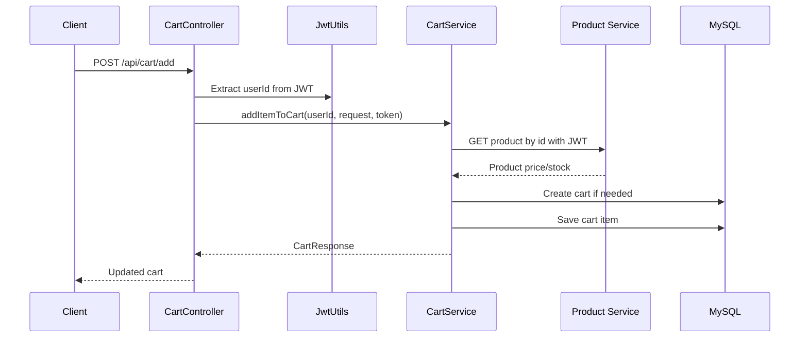

# Cart Service LLD

## Service Summary
- Service: `cart-service`
- Port: `8083`
- Database: MySQL `cart_db`
- Responsibilities:
  - Maintain per-user shopping carts
  - Add, view, remove, and clear items
  - Validate product existence and stock by calling `product-service`

## Internal Structure

## Main Components
### `CartController`
Endpoints:
- `POST /api/cart/add`
- `GET /api/cart`
- `DELETE /api/cart/remove/{itemId}`
- `DELETE /api/cart/clear`

Behavior:
- Extracts `userId` from JWT.
- Delegates business logic to `CartService`.

### `CartService`
Key methods:
- `addItemToCart(userId, request, token)`
- `getCartResponse(userId)`
- `removeItem(itemId)`
- `clearCart(userId)`

Responsibilities:
- Find or create cart by user id
- Call `product-service` before add
- Enforce stock-based quantity validation
- Convert entities to response DTOs

### External Call
- `fetchProduct(productId, token)`
- Calls `http://PRODUCT-SERVICE/api/products/{id}`
- Forwards original JWT in `Authorization` header

## Add-To-Cart Flow

## Data Model
- `Cart`
  - id
  - userId
  - items
- `CartItem`
  - id
  - productId
  - quantity

## Dependencies
- MySQL
- Eureka
- `product-service`
- JWT secret shared with other services

## Result
`cart-service` owns shopping cart state and uses synchronous validation against `product-service` to prevent invalid cart additions.
