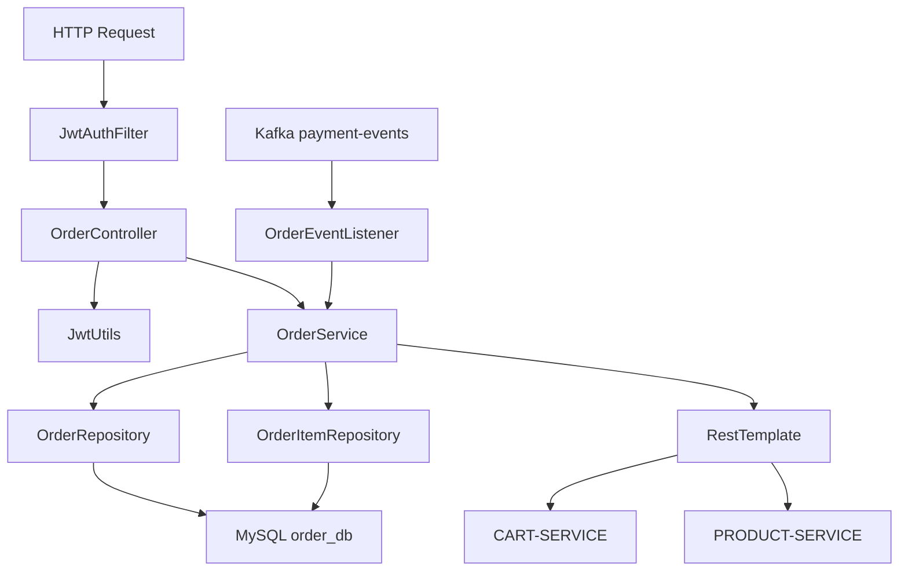
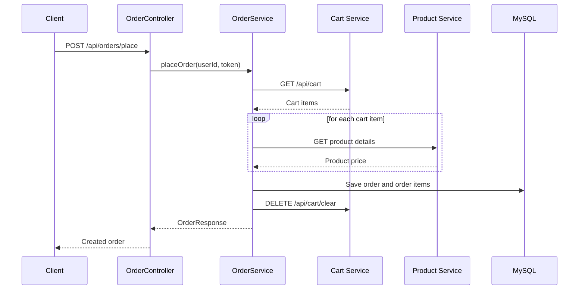
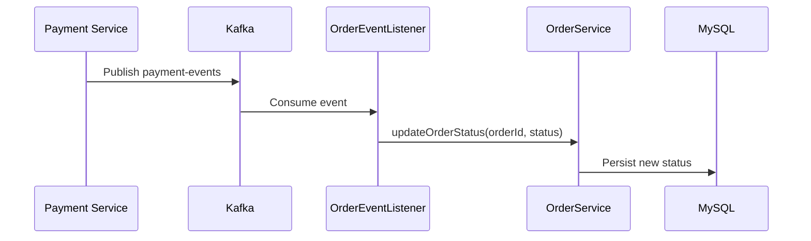

# Order Service LLD

## Service Summary
- Service: `order-service`
- Port: `8084`
- Database: MySQL `order_db`
- Responsibilities:
  - Create orders from cart contents
  - Query user orders
  - Update order status
  - React to Kafka payment events

## Internal Structure

## Main Components
### `OrderController`
Endpoints:
- `POST /api/orders/place`
- `GET /api/orders`
- `PUT /api/orders/update/{orderId}?status=...`

Behavior:
- Extracts `userId` from JWT for user-facing endpoints.

### `OrderService`
Key methods:
- `placeOrder(userId, token)`
- `getOrdersByUser(userId)`
- `updateOrderStatus(orderId, status)`

Responsibilities:
- Fetch current cart from `cart-service`
- Fetch product prices from `product-service`
- Compute total order amount
- Persist `Order` and `OrderItem`
- Clear cart after successful creation

### `OrderEventListener`
- Kafka consumer on topic `payment-events`
- Parses JSON payload
- Updates order status to `PAID` or `FAILED`

## Order Placement Flow

## Payment Update Flow

## Data Model
- `Order`
  - id
  - userId
  - totalAmount
  - status
  - createdAt
  - items
- `OrderItem`
  - id
  - productId
  - quantity
  - price

## Dependencies
- MySQL
- Eureka
- `cart-service`
- `product-service`
- Kafka

## Result
`order-service` is the orchestration core for checkout preparation: it converts cart state into persisted orders and then tracks final payment outcome asynchronously.
