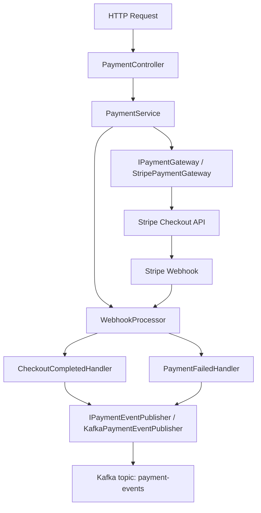
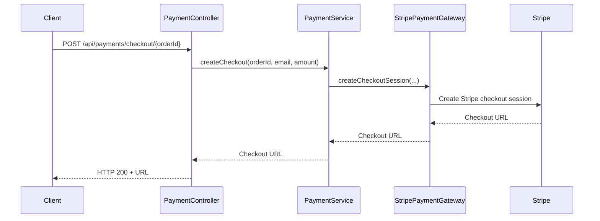
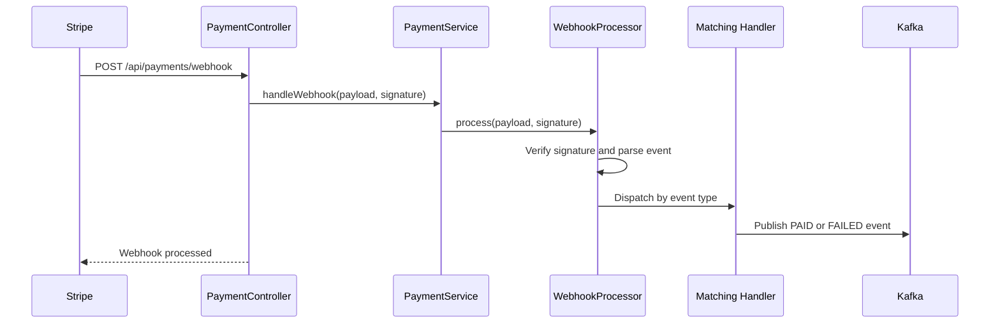

# Payment Service LLD

## Service Summary
- Service: `payment-service`
- Port: `8085`
- Database configured: MySQL `payment_db`
- Responsibilities:
  - Create Stripe checkout sessions
  - Receive and validate Stripe webhooks
  - Publish payment result events to Kafka

## Internal Structure

## Main Components
### `PaymentController`
Endpoints:
- `POST /api/payments/checkout/{orderId}`
- `POST /api/payments/webhook`

Behavior:
- Starts checkout for a given order id, email, and amount
- Accepts Stripe webhook payload and signature header

### `PaymentService`
- Thin application service delegating to:
  - `IPaymentGateway`
  - `WebhookProcessor`

### `StripePaymentGateway`
- Creates Stripe hosted checkout session
- Sets:
  - payment mode
  - customer email
  - success URL
  - cancel URL
  - metadata `order_id`
- Returns Stripe checkout URL

### `WebhookProcessor`
- Validates Stripe webhook signature using configured secret
- Selects matching webhook handler by event type

### Webhook Handlers
- `CheckoutCompletedHandler`
  - Supports `checkout.session.completed`
  - Extracts `order_id` and amount
  - Publishes `PAID` or `FAILED`
- `PaymentFailedHandler`
  - Supports `payment_intent.payment_failed`
  - Publishes failure event

### Event Publisher
- `KafkaPaymentEventPublisher`
- Writes `PaymentEventDTO` messages to topic `payment-events`

## Checkout Flow

## Webhook Processing Flow

## Dependencies
- Stripe
- Kafka
- MySQL configuration present
- Eureka

## Notable Design Notes
- Current code is integration-heavy and persistence-light.
- `IOrderServiceClient` and `IAuthServiceClient` exist as placeholders but are not yet implemented in the observed flow.
- Payment result propagation is event-driven instead of direct order callback.

## Result
`payment-service` is the external payment integration boundary for the platform and converts Stripe events into internal Kafka messages consumed by `order-service`.
