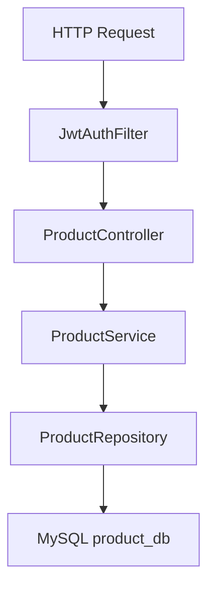
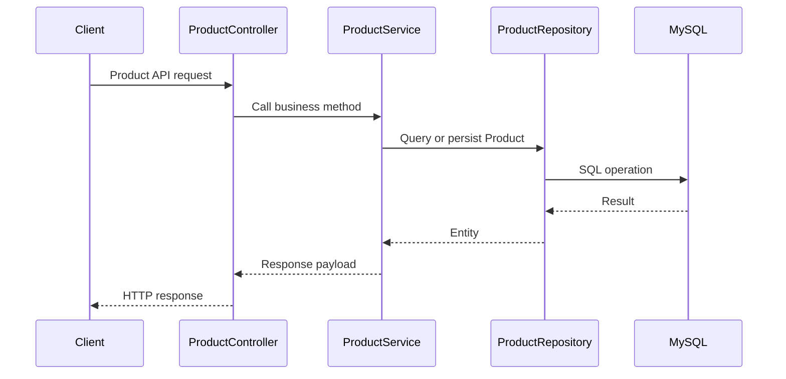

# Product Service LLD

## Service Summary
- Service: `product-service`
- Port: `8082`
- Database: MySQL `product_db`
- Responsibilities:
  - Product catalog retrieval
  - Product CRUD for admins
  - Source of product price and stock for downstream services

## Internal Structure

## Main Components
### `ProductController`
Endpoints:
- `GET /api/products`
- `GET /api/products/{id}`
- `POST /api/products`
- `PUT /api/products/{id}`
- `DELETE /api/products/{id}`

Authorization:
- Read: `ROLE_USER`, `ROLE_ADMIN`
- Write: `ROLE_ADMIN`

### `ProductService`
- `getAllProducts()`
- `getProductById(id)`
- `createProduct(request)`
- `updateProduct(id, request)`
- `deleteProduct(id)`

### Persistence
- `ProductRepository`
- Entity `Product`

### Security
- `SecurityConfig`
- `JwtAuthFilter`
- `JwtUtils`

## CRUD Processing Flow

## Data Model
- `Product`
  - id
  - name
  - description
  - price
  - stock

## Dependencies
- MySQL
- Eureka
- JWT secret shared with other services

## Result
`product-service` owns the product catalog and acts as the authoritative source for product metadata, price, and stock.
