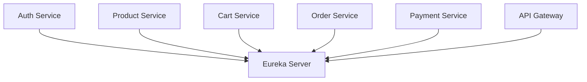

# Service Registry LLD

## Service Summary
- Service: `service-registry`
- Port: `8761`
- Framework: Spring Cloud Netflix Eureka Server
- Responsibility:
  - Maintain service registration and discovery data

## Internal Structure

## Main Components
### `ServiceRegistryApplication`
- Bootstraps the Eureka server.

### Configuration
- `register-with-eureka=false`
- `fetch-registry=false`
- Acts as the discovery authority rather than a client.

## Runtime Role
1. Service instances register on startup.
2. API Gateway and other services resolve peers by service name.
3. Logical service names such as `PRODUCT-SERVICE` and `CART-SERVICE` are translated to active instances.

## Dependencies
- No business-layer dependencies.
- Used by all application services.

## Result
`service-registry` is the discovery backbone of the system and enables loose coupling between callers and service instance locations.
